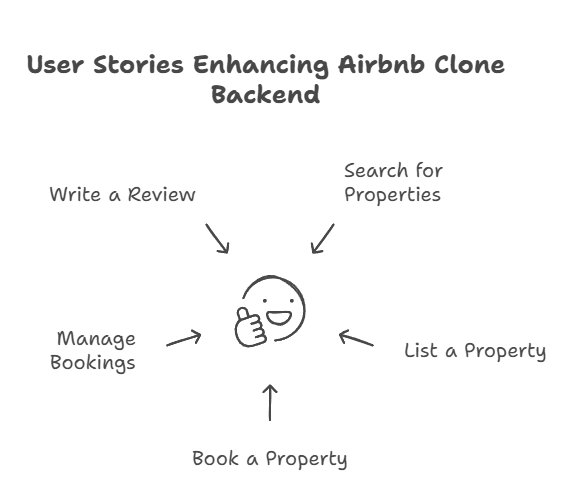

# User Stories for Airbnb Clone Backend

This document outlines five essential user stories that encapsulate the primary interactions within the Airbnb Clone backend system. These stories are designed to guide the development process by highlighting the needs and expectations of both guests and hosts. Each story reflects a specific functionality that enhances user experience and ensures smooth operations within the platform.

## User Stories

### Search for Properties
As a Guest, I want to be able to search for properties by location, date, and number of guests, so that I can find suitable accommodations for my trip.

### List a Property
As a Host, I want to be able to list a property with details such as description, amenities, and pricing, so that potential guests can view and book my property.

### Book a Property
As a Guest, I want to be able to book a property for specific dates and make a payment, so that I can secure my reservation.

### Manage Bookings
As a Host, I want to be able to manage my bookings, including accepting or declining requests, so that I can effectively manage my property's availability.

### Write a Review
As a Guest, I want to be able to write a review for a property I have stayed in, so that I can share my experience with other potential guests.

---

These user stories serve as a foundation for developing the backend functionalities of the Airbnb Clone, ensuring that both guests and hosts have a seamless and efficient experience on the platform.

